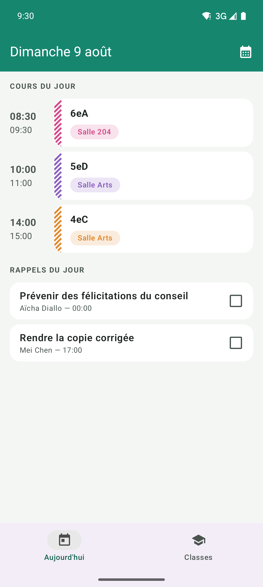

# MaClasse

[](LICENSE)
[](#requirements)
[](https://kotlinlang.org)
[](https://developer.android.com/jetpack/compose)

An Android app for secondary-school teachers to run their day: class rosters, seating
plans, a fair random picker, per-student notes and reminders, and a timetable that knows
which room you are in. Everything stays on the phone — no account, no server, no network
permission.

Built for French *collège* and *lycée* teachers (A/B week timetables, Pronote/ENT CSV
imports, French UI), but nothing stops it being used elsewhere.

*Version française : [README.fr.md](README.fr.md).*

| Today | Class roster | Seating plan |
|---|---|---|
|  |  |  |

## Features

**Classes and students** — create classes, add students with an optional photo, or import a
roster from a Pronote/ENT CSV export (encoding and separator are detected; you map the
name columns and preview the result before importing).

**Today** — the day's courses on a timeline with the current one highlighted, plus the
reminders due today. Tapping a course opens that class on its seating plan for the room
the course is in.

**Timetable** — weekly slots per class with A/B week parity, each tied to a room. Editable
week by week: cancel a single occurrence, restore it, or add a one-off course. A global
view shows every class in one week. Optionally synced into a local phone calendar named
"MaClasse".

**Rooms and seating plans** — draw a room by tapping to place desks and dragging to arrange
them; one- or two-seat tables, rotatable for U-shaped layouts. Rooms are shared between
classes, and each class can keep several named plans per room. Separation constraints are
highlighted in red when two students who must not sit together end up at the same table.

**Checklists** — collect one thing from a whole class: signed slips, trip payments, returned
books. Each checklist has an optional due date and shows how many are still missing; tick
students off as they hand in.

**Random picker** — draws a student without repeating until everyone has been picked, with
absences excluded for the day.

**Groups** — generates balanced groups that respect "these two must not be together"
constraints, and tells you when the constraints cannot all be satisfied. Groupings can be
saved under a name.

**Student pages** — notes, custom fields, and reminders that fire as a notification: at a
fixed date and time, in a morning digest, or before the next lesson with that class.

**Backup and restore** — the whole database plus photos and settings in a single file, saved
wherever the system picker allows (Drive, SD card, …). Optionally encrypted with a
password, since the file contains student data.

**Language and appearance** — French and English, light and dark, each choosable inside the
app independently of the phone's settings.

## Privacy

The app has no `INTERNET` permission. There is no account, no analytics, no crash
reporting, and no data leaves the device unless you explicitly export a backup or sync to
your own phone calendar. Backups can be encrypted with AES-256-GCM (PBKDF2-SHA256, 200 000
iterations). See [PRIVACY.md](PRIVACY.md).

## Requirements

- Android 10 (API 29) or newer on the device
- Android Studio (recent stable) or a JDK for command-line builds — the Gradle daemon is
  pinned to Java 25 in `gradle/gradle-daemon-jvm.properties` and will auto-provision it
- Android SDK Platform 37 (`compileSdk`)

## Building

```bash
git clone https://github.com/nosari20/class-manager.git
cd class-manager
./gradlew assembleDebug          # APK in app/build/outputs/apk/debug/
./gradlew installDebug           # build and install on a connected device
```

On Windows use `gradlew.bat`. If several devices are attached, set `ANDROID_SERIAL` so the
install targets the right one.

## Testing

```bash
./gradlew testDebugUnitTest      # unit tests (JVM + Robolectric)
./gradlew lintDebug              # Android lint
```

The domain layer is plain Kotlin and carries the bulk of the tests: CSV parsing, A/B week
parity, timetable occurrences, group generation, seating adjacency, backup validation and
encryption, locale and theme resolution.

`targetSdk` is deliberately held at 35: Robolectric refuses to run against a preview
platform, so raising it breaks the whole unit-test suite.

## Project layout

```
app/src/main/java/edu/fnosari/classmanager/
├── AppContainer.kt         manual dependency container, created in ClassManagerApp
├── MainActivity.kt         per-app locale wrapping, theme resolution, edge-to-edge
├── backup/                 zip backup + AES-GCM encryption
├── calendar/               sync into a local device calendar
├── data/                   Room entities, DAOs, migrations, DataStore settings, demo data
├── domain/                 pure Kotlin, no Android imports — the tested core
├── notifications/          channels, exact alarms, boot rescheduling
└── ui/                     Compose screens, one package per feature, MVVM
```

Architecture is single-module MVVM: Compose screens observe `StateFlow`s from a ViewModel,
ViewModels talk to Room DAOs and the settings repository through `AppContainer`. There is
no DI framework — the container is constructed once in `Application.onCreate` and reached
from Compose via `LocalContext.current.appContainer`.

The database uses `exportSchema = true`; schemas live in `app/schemas/`. Adding an entity
or column means a new version plus a migration (auto-migrations where possible, hand-written
where a primary key or foreign key changes) **and** bumping `BackupManager.SCHEMA_VERSION`,
otherwise older backups will be accepted and then fail to restore.

## Localisation

`values/strings.xml` (English) and `values-fr/strings.xml` (French) are kept key-for-key
identical. To add a language, copy `values/strings.xml` into `values-<code>/`, translate it,
and add the locale to `res/xml/locales_config.xml` so it appears in the in-app picker and in
Android's per-app language settings.

## Roadmap / TODO

- [ ] **Import a timetable from a Pronote `.ics` export** — days, hours, rooms and classes in
  one file, with the weekly A/B pattern inferred rather than typed (`DTSTART`/`DTEND` → hours,
  `LOCATION` → room, `SUMMARY` → class), a confirmation screen before anything is written, and
  a `sourceUid` column added in the same migration so a later re-import can update instead of
  duplicate. Design is settled; **blocked on a real export** — the `SUMMARY` format varies per
  établissement and decides how class names are recognised.
- [ ] **Split one student CSV into several classes** — Pronote roster exports usually carry a
  "Classe" column, so one import could create every class instead of one import per class.
  Today `CsvImportScreen` maps last name and first name only.
- [ ] **Accept files from the share sheet** — an intent filter for `.ics` and `.csv` so a file
  can be sent straight from Pronote or a mail attachment, skipping the download-then-pick step.
- [ ] **Room layout presets** — start a room from a grid or a U shape instead of placing every
  desk by hand.
- [ ] **Timetable subscription** (deliberately deferred) — the same import from a Pronote iCal
  URL, refreshed automatically. Costs the `INTERNET` permission and stores a bearer token on
  the device, so it is only worth it if re-importing by hand becomes tedious.

Release engineering, before any public build:

- [ ] Re-enable optimisation for release builds and verify a restore and a notification on the
  signed bundle.
- [ ] Bump `versionCode` for every upload.

Release bundles are signed from Android Studio (*Generate Signed App Bundle*), so there is no
`signingConfig` in the Gradle files and no keystore anywhere near the repository.

The `applicationId` is settled: `edu.fnosari.classmanager`, kept as is. It is invisible to
users, and changing it after publication would create a separate app with no upgrade path.

## Contributing

Bug reports and patches are welcome at
[github.com/nosari20/class-manager](https://github.com/nosari20/class-manager) — see
[CONTRIBUTING.md](CONTRIBUTING.md) for the build, test and commit conventions, and
[CODE_OF_CONDUCT.md](CODE_OF_CONDUCT.md) for the ground rules. Security issues:
[SECURITY.md](SECURITY.md).

Please do not attach real student data to an issue — reproduce with the built-in demo data
(Settings → *Create demo data*) instead.

## License

Copyright (C) 2026 Florent Nosari.

This program is free software: you can redistribute it and/or modify it under the terms of
the GNU General Public License as published by the Free Software Foundation, either version
3 of the License, or (at your option) any later version. It is distributed in the hope that
it will be useful, but **without any warranty**; without even the implied warranty of
merchantability or fitness for a particular purpose. See the [GNU General Public
License](LICENSE) for details.

## Trademarks

Not affiliated with, endorsed by, or connected to Index Éducation. "Pronote" is their
trademark and is referred to here only to describe the file formats this app can import.
